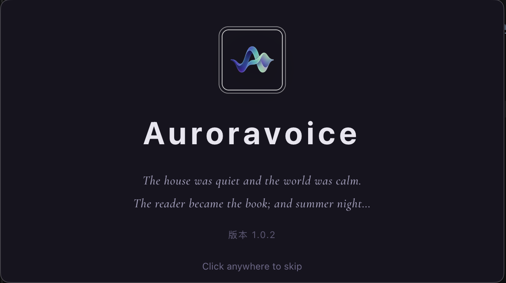
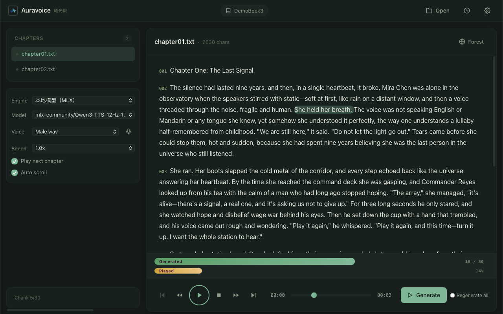
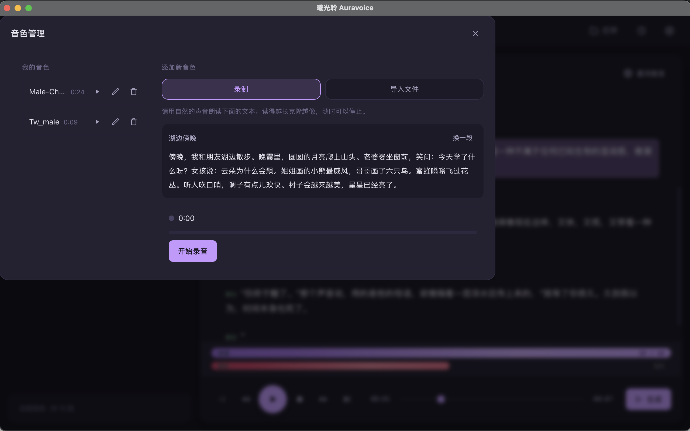
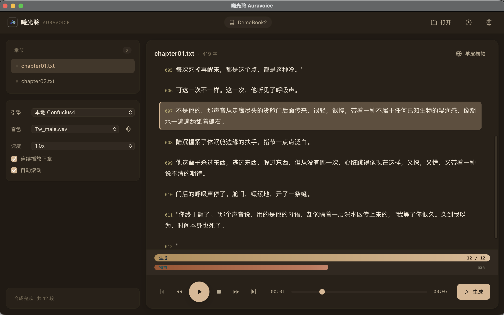

[Intro](index.md) · [Install](install.md) · [Guide](guide.md) · [Voices & Models](voices.md) · [FAQ](faq.md) · [Privacy](privacy.md) | **[简体中文](../zh/index.md)**

*"The house was quiet and the world was calm. The reader became the book…"*

Auroravoice is a local desktop app for macOS that reads Chinese (and English) text files aloud with natural, human-like voices — fully offline, powered by on-device MLX inference.

  

    

      

        

          
          
Splash screen · click to enlarge

        

      

      

        

          
          
English reading interface · click to enlarge

        

      

      

        

          
          
Recording reference voice · click to enlarge

        

      

      

        

          
          
Chinese reading interface · click to enlarge

        

      

      

        

          

            
            
          

          
Demo video · click to play

        

      

    

  

  <button class="carousel-btn prev" aria-label="Previous">‹</button>
  <button class="carousel-btn next" aria-label="Next">›</button>
  

  
← Swipe to cycle · click image to enlarge / video to play →

  <button class="close" aria-label="Close">×</button>
  

## Highlights

- **Local inference** — models run on your Apple Silicon Mac; your text never leaves the machine
- **Listen while generating** — chunk-by-chunk synthesis, playback starts immediately
- **Voice cloning** — read a sample in-app or import audio; a personal voice in under a minute
- **Resume anywhere** — progress auto-saved every few seconds; synthesis picks up where it stopped
- **Multi-engine** — local MLX (recommended), remote API, or Edge TTS
- **Bilingual UI** — 中文 / English, 5 preset themes

## Who it's for

- Anyone who'd rather *listen* to novels and articles
- Privacy-conscious users who want TTS fully offline
- People who want text read in their own voice

> 💬 Have ideas or issues? [Submit feedback & suggestions →](https://github.com/auroravoice/user_guide/issues/new?template=feedback.yml)

Next: [Installation →](install.md)
